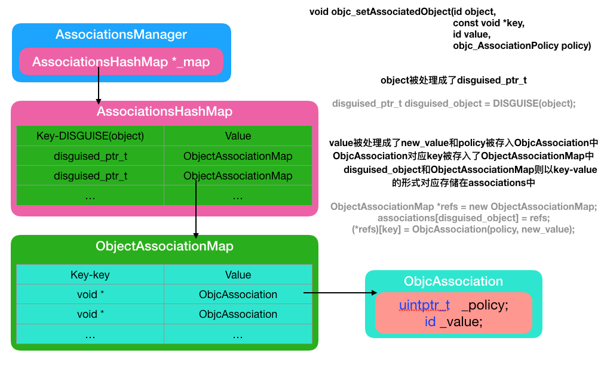

## weak实现原理

参考链接：https://www.jianshu.com/p/f331bd5ce8f8

   * weak由runtime持有的weak_table实现，每个对象有对应的weak_entry_t
   * 获取oldobj(弱引用所指向的之前对象) unregister，替换为newobj的hashtable, register，
    weak表是hash表，对象的weak指针数组，销毁对象的时候所有weakrefernce置为nil

## KVO 实现原理

参考：https://juejin.cn/post/6844903593925935117

iOS系统会修改这个对象的isa指针，改为指向一个全新的通过Runtime动态创建的子类(KVONOtification)，子类拥有自己的set方法实现，set方法实现内部会顺序调用willChangeValueForKey方法、原来的setter方法实现、didChangeValueForKey方法，而didChangeValueForKey方法内部又会调用监听器的observeValueForKeyPath:ofObject:change:context:监听方法。

## 如何扩大点击区域

    事件响应链会调用pointInSide，重写pointInSide，edgeInsets扩大范围检测

## OC实现链式调用

https://juejin.cn/post/7010958824933130253

提供返回block的方法， block内部返回self，返回self是实现链式的核心。

## 自动释放池内对象释放时机

https://juejin.cn/post/7010726670181253127

自动释放池对象AutoreleasePool被销毁时，有可能是当前runloop结束进入休眠，会对池内的所有对象发送release指令。
本质是有个双向链表存储所有池内对象，一页放满就新建一页，放入新的页面中。

## Struct和Class的区别

|  Comparision |    \|Class  |  Structure  |
|  ----  | ----  | ----  |
|  Type	 | Classes are reference types.	 | Structures are value types. |
| Inheritance | Classes have an inheritance that allows one class to inherit the characteristics of another.	 | Structures do not support inheritance. |
| Storage	 | Class instances are stored on the heap.	 | Structure properties are stored on the stack. |
| Initializer	 | We have to define the initializer manually.	 | Struct gets a default initializer automatically. |
| Thread−safe	 | Classes are not fully thread−safe.	 | The structure is thread−safe or singleton at all times. |

## Category实现原理

https://juejin.cn/post/6844903602524274696

从源码基本可以看出我们平时使用categroy的方式，对象方法，类方法，协议，和属性都可以找到对应的存储方式。并且我们发现分类结构体中是不存在成员变量的，因此分类中是不允许添加成员变量的。分类中添加的属性并不会帮助我们自动生成成员变量，只会生成get set方法的声明，需要我们自己去实现。

category的方法会在运行时加到原来类的方法列表之前，所有category的方法协议会覆盖原来类的方法和协议等。

category中有load方法，先执行原来的load方法，load方法在类加载时候调用,initalize在类第一次使用的时候调用。

## 关联对象（添加新的成员变量）

https://juejin.cn/post/6844903605347057672

AssociationsManager拥有AssociationsHashMap=>value为ObjectAssociationMap=>valuew为ObjcAssociation（set_assoicated设置的_policy、value）。

通过上图我们可以总结为：一个实例对象就对应一个ObjectAssociationMap，而ObjectAssociationMap中存储着多个此实例对象的关联对象的key以及ObjcAssociation，为ObjcAssociation中存储着关联对象的value和policy策略。

## 待定